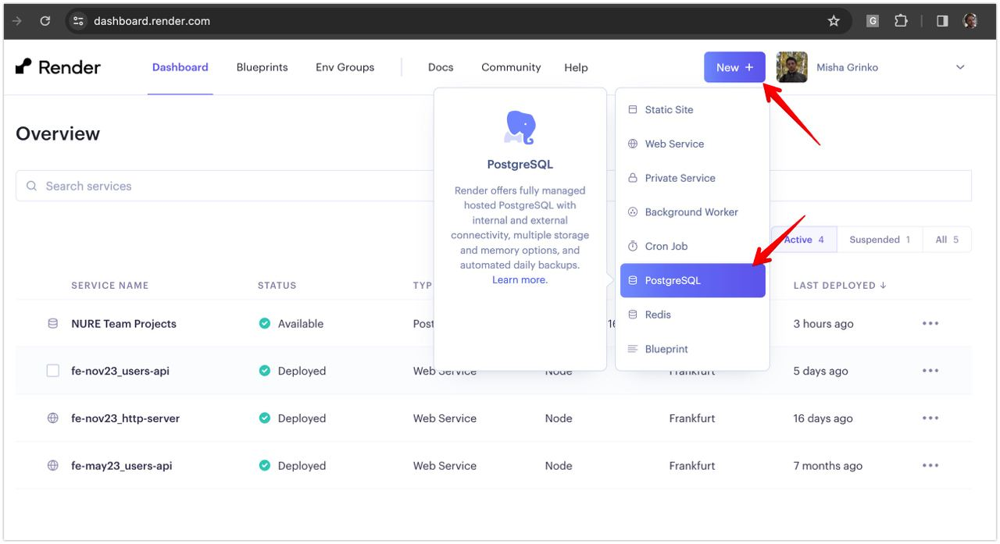
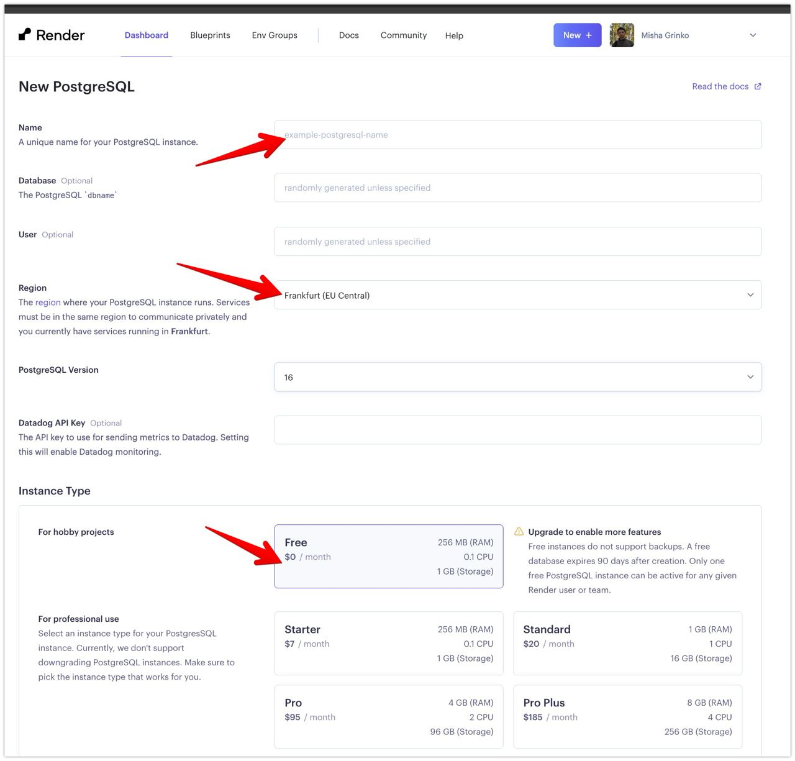
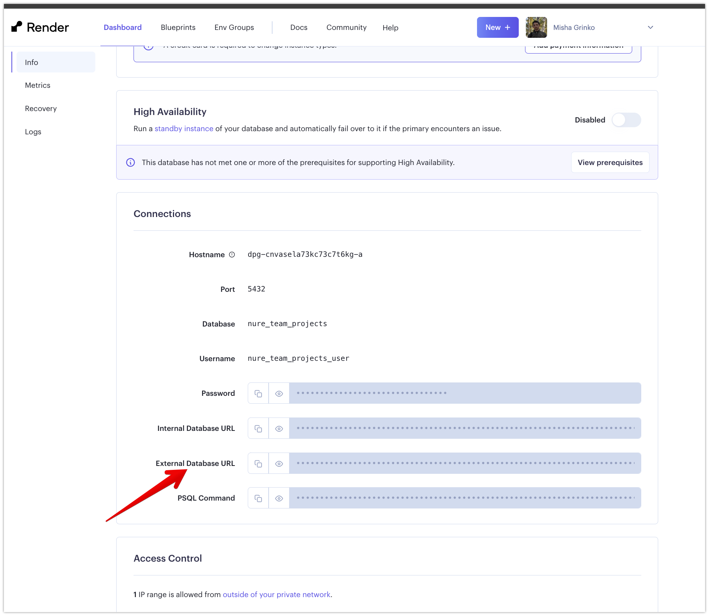

1. Register at [render.com](http://render.com)
1. Create a free PostgreSQL instance
    
    
1. Copy `External Database URL` to `DATABASE_URL` in the [.env](.env)
    
1. Istall dependencies
    ```shell
    npm i
    ```
1. Create Prisma types
    ```shell
    npx prisma generate
    ```
1. Create a first migration script and apply DB structure from [schema](./prisma/schema.prisma)
    ```shell
    npx prisma migrate dev --name init
    ```
1. Fill DB with initial data (see [prisma/seed.ts](./prisma/seed.ts))
    ```shell
    npm run seed
    ```